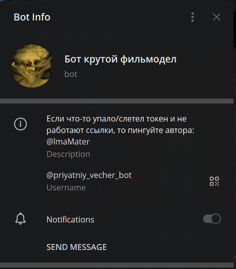
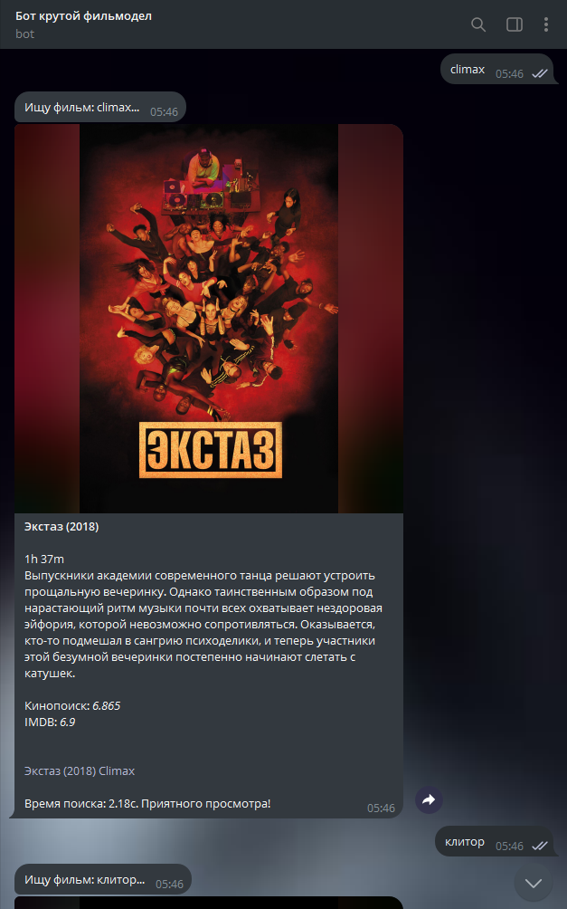

# CinemaBot

CinemaBot — это Telegram-бот для поиска фильмов и сохранения истории запросов. Он поддерживает асинхронную работу и сохраняет данные в SQLite базу данных.

## Технологии и зависимости:
- **Язык**: Python 3.10+
- **Библиотеки**:
   - `aiogram` — для работы с Telegram Bot API
   - `aiohttp` — для асинхронных HTTP-запросов
   - `sqlite3` — для хранения истории и статистики
   - `RapidFuzz` — для сравнения строк и подбора наиболее релевантных результатов


## Команды бота:
- `/start` — начать работу с ботом
- `/help` — справочная информация со всеми командами
- `название_фильма` — выполняет поиск информации о фильме и предоставляет ссылку для просмотра в VK
- `/history` — история последних 10 поисковых запросов для текущего пользователя
- `/stats` — статистика фильмов: сколько раз предлагался каждый фильм (отдельно для каждого пользователя)

## Как работает бот:
1. **Архитектура:**
   - Основной файл: **`cinema_bot.py`** — отвечает за логику обработки команд и сообщений 
   - Модуль работы с базой данных: **`db_manager.py`** — управляет сохранением истории запросов и статистики фильмов.
   - Модуль поиска фильмов: **`movie_searcher.py`** — отвечает за поиск информации о фильмах с использованием API.
      + первично используется поверхностный поиск `kp_query` в КиноПоиске (без проваливания на страницу) для идентификации фильма и информации о нем
      + если фильм найден, cледующим шагом, передаем в поиск VK Video строку формата "*название_фильма (год)*" и отбираем лучшего кандидата через сравнивание строк [RapidFuzz](https://pypi.org/project/RapidFuzz/)

2. **База данных:**
   - Используется SQLite, структура хранится в файле **`cinema_bot.db`**
   - Данные:
     - История запросов: `search_history` (пользователь, запрос, фильм, время).
     - Статистика: `movie_stats` (пользователь, фильм, количество).

3. **Интеграция с внешними API:**
   - Для работы приложения и поиска фильмов используются API:
     - [TelegramApi](https://core.telegram.org/bots/api)
     - [Kinopoisk.dev](https://kinopoisk.dev/)
     - [VK API](https://vkhost.github.io/)

## Установка и сборка:

### 1. Клонирование репозитория
Клонируйте репозиторий в локальную папку:
```bash
git clone https://github.com/yourusername/cinemabot.git
cd cinemabot
```

### 2. Установка зависимостей
Убедитесь, что у вас установлен Python версии 3.10 или выше. Установите необходимые зависимости:

```bash
pip install -r requirements.txt
```

### 3. Настройка окружения
Создайте файл .env в корне проекта и добавьте в него ваши токены:

```env
BOT_TOKEN=Ваш_токен_BotFather
VK_TOKEN=Ваш_токен_VK
KP_TOKEN=Ваш_токен_Kinopoisk
```

### 4. Запуск бота
Запустите бота с помощью следующей команды:

```bash
python cinema_bot.py
```

### Приятного использования!
Бот доступен в Telegram по нику [@priyatniy_vecher_bot](https://t.me/priyatniy_vecher_bot), но вероятнее всего сейчас не крутится и придется разворачивать самому.
<div style="display: flex; justify-content: center; gap: 20px;">
    
    
</div>
